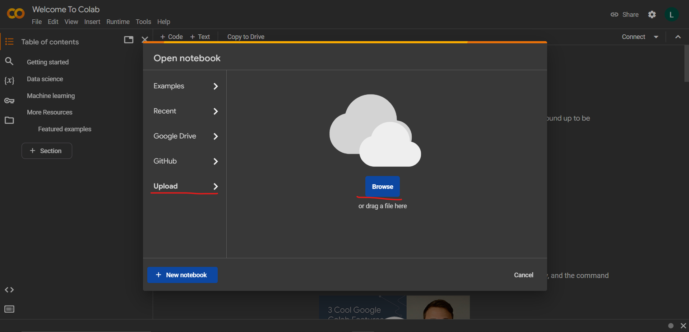

**MVP приложение "Аналитическая платформа" для хакатона ТМК**

Цель - создать инструмент для анализа рынка зарплат

Чтобы посмотреть возможности приложения, необходимо открыть файл Ad-hoc statistic.ipynb в среде google.colab
https://colab.research.google.com/

Затем запустить ячейки и выполнить указанные в них инструкции:
указать запрос вакансии (как будто пишете запрос на сайте хх.ру)

Выбрать опыт работы (число от 0 до 3)
Затем выполнить все оставшиеся ячейки по очереди.

В результате вы получите график со статистикой зарплат:
Первая строчка - общая по России
в остальных - детализация по компаниям (в скобках указано количество вакансий)
